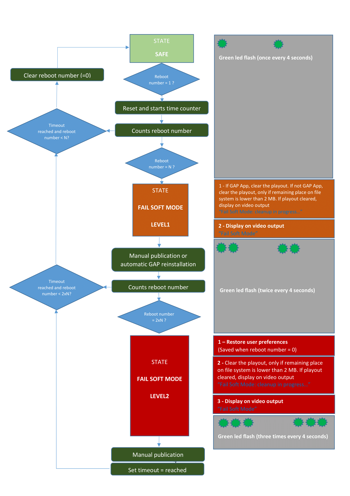

# **Fail Soft Mode Behaviour**

# Goal of the document

The goal of this document is to explain how does work the &quot;**Fail Soft Mode**&quot; feature.

# Summary
    
The Fail Soft Mode feature permits to stop playing device content when some instability is detected (several unexpected player reboots happen in few minutes).

When the player is in Fail Soft Mode,
- A specific Fail Soft Mode pop-up is displayed on the screen
- The green led (at the back of the player) is blinking by following a specific sequence

To return to Normal Mode, new publishing or App purging is required. Attention: most of time, unexpected reboots are certainly due to a specific media inserted in the playout and not supported by the player (it can be an audio-video media, or any other media), so it is advised to look for the wrong media and remove it before publishing again

The Fail Soft Mode is a security feature implemented in Gekkota_os since Gekkota 3.12.15. For security reasons, the Fail Soft Mode feature is automatic and can not be removed from the player

# Strategy

The feature &quot; **Fail Soft Mode**&quot; has been implemented to restore some players which don&#39;t keep rebooting into stable configuration. The reboot is most often the consequence of the specific playout (taken by the player):

- containing one media (most of time, or several medias) making crash the player or
- running an App that consumes too much memory or
- running an App that hangs the Javascript virtual machine or
- containing an unfortunate reboot programmed in calendar every minute

# Legacy platforms and software version

The following players support **Fail Soft Mode** feature.

| **Platform family** | **Software release version** |
| --- | --- |
| **DM4** | Gekkota\_os DMB400 4.10.10 (or later) |
| **SM3** | Gekkota\_os SMA300 3.12.19 (or later) |
| **SM2** | Gekkota\_os SMT210 3.12.15 (or later) |
| **SM2** | Gekkota\_os SMA200 3.12.15 (or later) |
| **SM2** | Gekkota\_os SMP200 3.12.15 (or later) |
| **DM2\*** | Gekkota\_os DMC200 3.12.15 (or later) |
| **DM3** | Gekkota\_os DMB300 3.12.15 (or later) |

\*DMC200 players having Kontron electronic part whose BIOS revision is below NOW1R115 do not support Fail Soft Mode.

# Principe

The player is able to surveying unexpected player reboot. After several unexpected reboots, the player detects stability anomaly:

1. The player can clear the playout content and wait for new content ( **Fail Soft Mode level1** ). If the player is configured to pull a GAP (Gekkota Application Package) file from a server, this GAP file is automatically downloaded and reinstalled after clean-up.
2. Despite of that, in case the player does not keep rebooting again, the player is able to restore user preference (saved before the player is unstable) and wait for new content ( **Fail Soft Mode level2** )

# Reboot number

A variable &quot;reboot number&quot; counts the number of reboot inside a time Window. Its current value can be read in the **systemMaintenance.failsoftNbReboots** attribute (see documentation about nsISystemMaintenance interface).

- The reboot number value to reach Fail Soft Mode level 1 is N.
- The reboot number value to reach Fail Soft Mode level 2 is 2XN.

N depends on platform. Its value can be read in the **systemMaintenance.failsoftMaxReboots** attribute (see documentation about nsISystemMaintenance interface).

| **Platform family** | **Platform** | **N (to reach Fail Soft Mode level1)** | **2N (to reach Fail Soft Mode level2)** |
| --- | --- | --- | --- |
| **DM4** | DMB400 | 6 | 12 |
| **SM3** | SMA300 | 6 | 12 |
| **SM2** | SMT210 | 4 | 8 |
| **SM2** | SMA200 | 4 | 8 |
| **SM2** | SMP200 | 4 | 8 |
| **DM2** | DMC200 | 4 | 8 |
| **DM3** | DMB300 | 4 | 8 |

- In case a reboots occurs in the time slot, the variable &quot;reboot number&quot; increases of 1
- In case &quot;reboot number&quot; is lower than N (N = 4 or N = 6) inside the time slot duration, the player is considered as to be in stable state and the &quot;reboot number&quot; is reset to 0

_Note: firmware downloads make &quot;reboot number&quot; increase of 1_

_Note: &quot;restart player&quot; button of WebUI does not make &quot;reboot number&quot; increase of 1_

# Generation of Fail Soft Mode

It is possible to generate a **Fail Soft Mode** by unplugging and plugging again the power supply N times (or 2N time). N is depending on the player type (explained in the table above)

ex:
1. Iteration\_number = 0;
2. Unplug and plug again the power supply and let the player booting up. The device green led is blinking ( **1 flash every 4 seconds** ),
3. If Iteration\_number = N (in the table above), then go to the step 4, else go again to the step 2 (Iteration\_number + 1)
4. The system screen Fail Soft Mode is displayed

5. Iteration\_number = N;
6. Unplug and plug again the power supply and let the player booting up. The device green led is blinking ( **2 flashs every 4 seconds** ),
7. If Iteration\_number = 2N (in the table above), then go to the step 8, else go again to the step 6 (Iteration\_number + 1)
8. The system screen Fail Soft Mode is displayed

# Timer (time counter)

When the variable &quot;reboot number&quot; pass from 0 to 1, this reboot is considered as &quot;1st reboot&quot;. At this time counter is reset to 0 and starts to count elapsed time since 1st reboot.

# Time windows (timeout)

The time window is depending on 2 parameters

- A default timeout value: 300 seconds (5 minutes) (default timeout if no NTP)

| **Platform family** | **Platform** | **Default timeout value** |
| --- | --- | --- |
| **DM4** | DMB400 | 420 sec (7 minutes) |
| **SM3** | SMA300 | 240 sec (4 minutes) |
| **SM2** | SMT210 | 300 sec (5 minutes) |
| **SM2** | SMA200 | 300 sec (5 minutes) |
| **SM2** | SMP200 | 300 sec (5 minutes) |
| **DM2** | DMC200 | 300 sec (5 minutes) |
| **DM3** | DMB300 | 300 sec (5 minutes) |

Additional NTP timeout value depending on

  - NTP trial number &amp; NTP delay between trial
  - Reboot number

The timeout is considered to be reached when any reboot is not noticed in the specified time window.

    Additional NTP timeout = [NTP trial number] x [NTP Time between retry] x [reboot number]

Example for SMA300 platform: After 4 following reboots, the player becomes stable, the windows time to wait before the player enters in **SAFE STATE** is:

    Total windows time (timeout) = 50 x 10 x 4 + 240 = 2240 seconds
    With NTP trial number = 50
    With NTP delay between trial = 10
    With reboot number = 4
    With default timeout value = 240

# User preferences saving

User preferences are saved at each player start-up if reboot number is equal to zero.

# State machine

